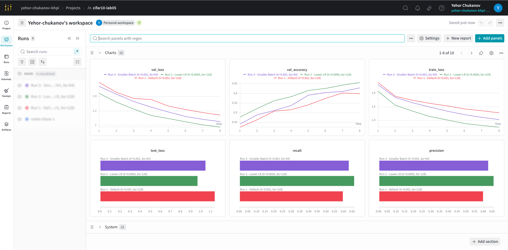
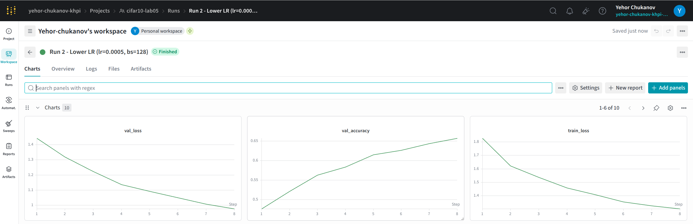
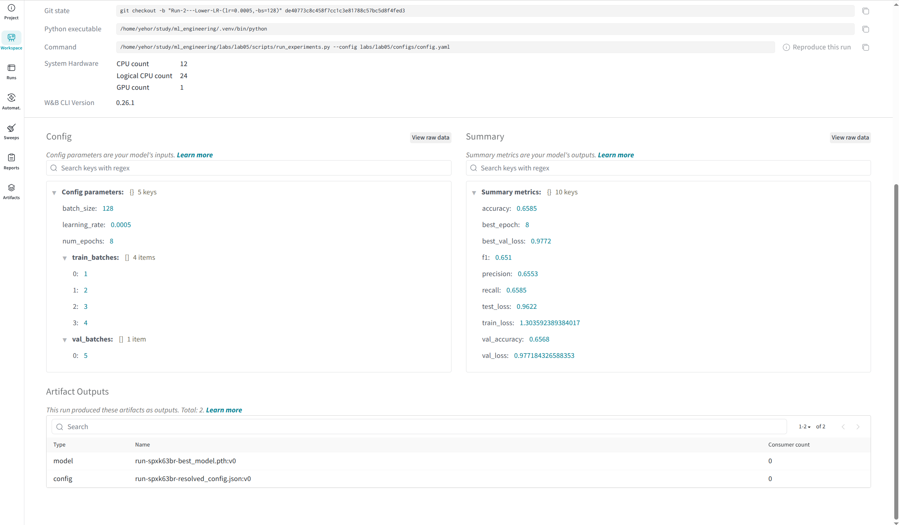
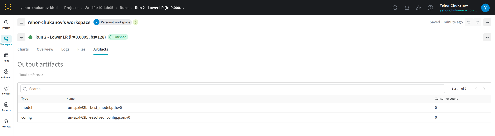

# Lab 05 Report: Weights & Biases Experiment Tracking and Artifact Management

## 1. Introduction

This lab integrates Weights & Biases (W&B) into the CIFAR-10 training pipeline for centralized experiment tracking, parameter management, and metric visualization. The objective was to log multiple runs with different hyperparameters, track per-epoch training metrics, store model artifacts, and demonstrate comparative analysis of runs via the W&B dashboard.

## 2. Tracking Setup

### Environment and tools

- Python environment: `.venv` (Python 3.11)
- W&B SDK version: `0.26.1`
- Project name: `cifar10-lab05`
- Initial mode: `offline` (local logging to `./wandb/`)

### Initialization

W&B is initialized at the start of each experiment run via `wandb.init()` with configuration passed as a dictionary:

```python
wandb.init(
    project="cifar10-lab05",
    name=run_name,
    config={
        "batch_size": batch_size,
        "learning_rate": learning_rate,
        "num_epochs": num_epochs,
        ...
    },
    mode="offline"|"online",
    reinit=True,
)
```

### Offline mode and synchronization

All 3 runs executed in **offline mode**. W&B saved run data locally under `./wandb/offline-run-*` directories. To synchronize logged data with the cloud W&B project after setting up an account:

```bash
WANDB_API_KEY=<your_api_key> .venv/bin/wandb sync ./wandb/offline-run-*
```

### Dashboard screenshots

**Figure 1 — Project workspace: all runs with comparison charts (`val_loss`, `val_accuracy`, `train_loss`, `test_loss`, `recall`, `precision`)**



**Figure 2 — Single run page (Run 2 - Lower LR): epoch-level `val_loss`, `val_accuracy`, `train_loss`**



**Figure 3 — Run overview: config parameters, summary metrics, and artifact outputs**



**Figure 4 — Artifacts tab: versioned `model` and `config` artifacts for Run 2**



## 3. Logging Details

### Parameters logged per run

Via `wandb.config`:

- `batch_size` (128 or 64)
- `learning_rate` (0.001 or 0.0005)
- `num_epochs` (8)
- `train_batches` (list [1, 2, 3, 4])
- `val_batches` (list [5])

### Metrics logged per epoch

Via `wandb.log()` with step counter:

- `train_loss`
- `val_loss`
- `val_accuracy`

### Final metrics logged per run

- `test_loss`
- `accuracy`
- `precision`
- `recall`
- `f1`
- `best_val_loss`
- `best_epoch`

### Artifacts logged per run

Via `wandb.log_artifact()`:

- `best_model.pth` (PyTorch state dict)
- `resolved_config.json` (run-specific configuration snapshot)

Artifacts are also saved locally under `artifacts/lab05/<run_name>/`.

## 4. Experimentation Process

### Run definitions

Three runs were logged with structured names following the pattern "Run N - Description":

| Run Name | Batch Size | Learning Rate | Accuracy | F1 | Test Loss |
|---|---:|---:|---:|---:|---:|
| Run 1 - Default (lr=0.001, bs=128) | 128 | 0.0010 | 0.5930 | 0.5823 | 1.1332 |
| Run 2 - Lower LR (lr=0.0005, bs=128) | 128 | 0.0005 | 0.6585 | 0.6510 | 0.9622 |
| Run 3 - Smaller Batch (lr=0.001, bs=64) | 64 | 0.0010 | 0.6270 | 0.6144 | 1.0410 |

Best run by accuracy: **Run 2 - Lower LR (lr=0.0005, bs=128)**

### W&B dashboard insights (when synced to cloud)

- Per-run comparison of accuracy/loss trends across epochs
- Final test metric tables for ranking by various metrics
- Parallel coordinates for hyperparameter importance visualization
- Artifact versioning and download capability

## 5. Reflection

### Benefits

- **Structured experiment naming**: Run names encode hyperparameter decisions, improving readability in W&B dashboard.
- **Offline-first workflow**: Local logging (`.wandb/` directory) removes dependency on cloud connectivity during training; synchronization is decoupled.
- **Rich visualization**: W&B auto-generates metric charts, parallel coordinate plots, and comparison tables without manual configuration.
- **Artifact versioning**: Logged model checkpoints are timestamped and retrievable per run without filesystem complexity.

### Challenges

- **Cloud account requirement**: W&B experiment comparison and visualization require an active cloud project and API authentication.
- **Offline mode limitations**: Offline runs must be manually synced to cloud; real-time dash updates unavailable without online mode.
- **Reinit complexity**: W&B's `reinit=True` parameter required to start new runs in same script context; behavior differs from MLflow's native multi-run API.

### Potential improvements

- Configure W&B alerts on metric thresholds (e.g., accuracy drop) for automated monitoring.
- Integrate W&B Sweeps for automated hyperparameter search instead of manual config variants.
- Use W&B Reports to generate automated lab report artifacts from run metadata and charts.
- Archive offline runs to a shared cloud project for team collaboration on results.
