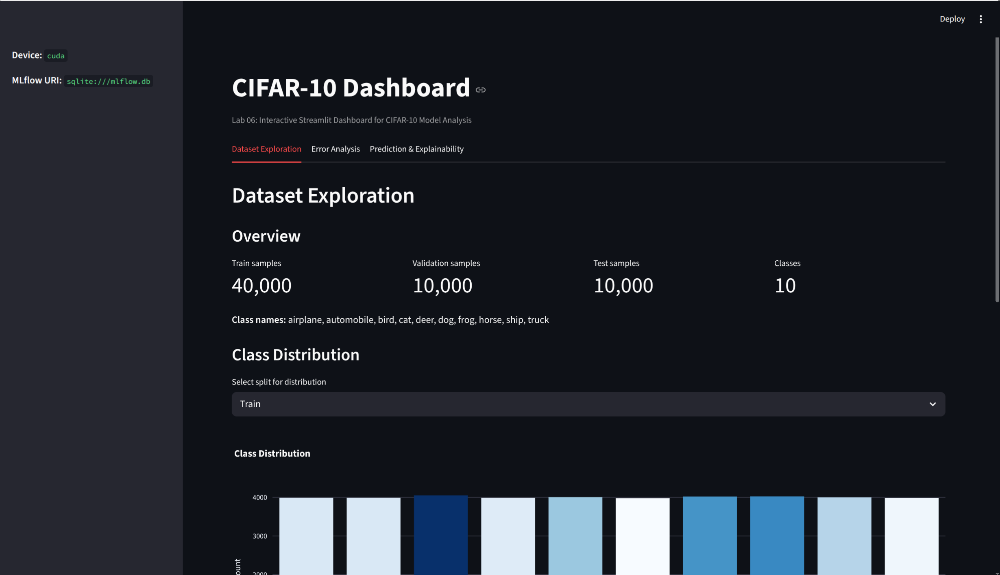
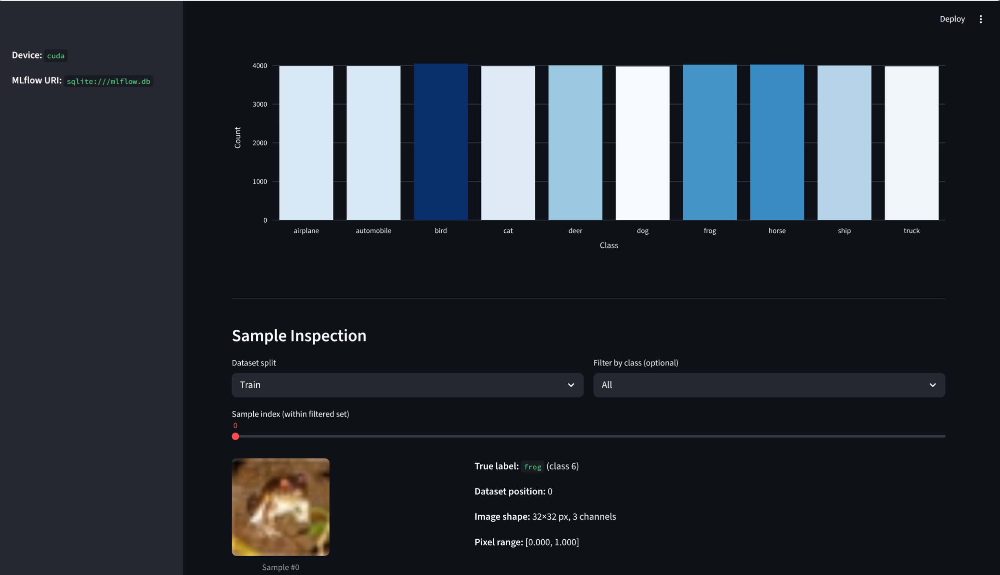
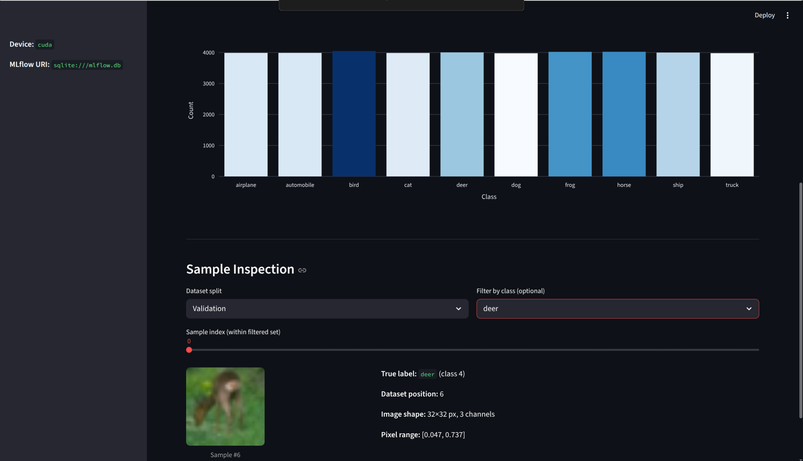
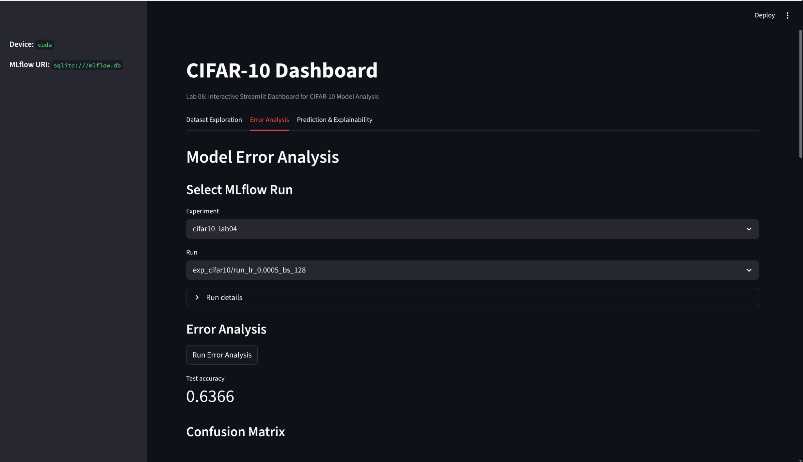
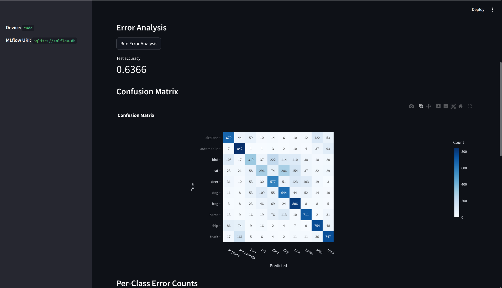
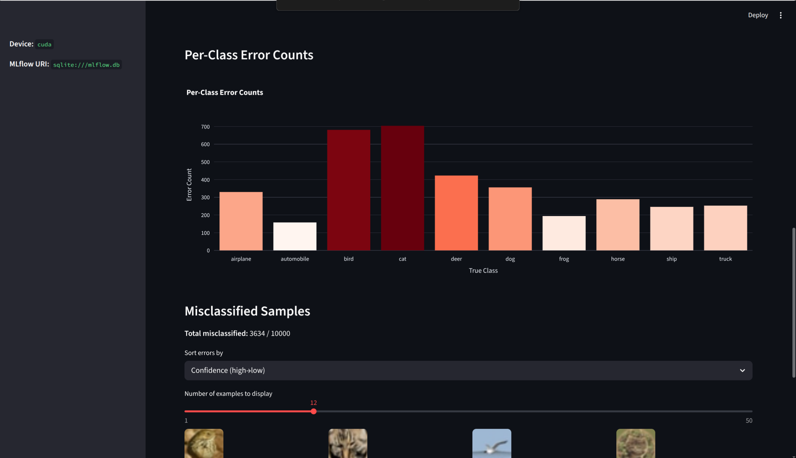
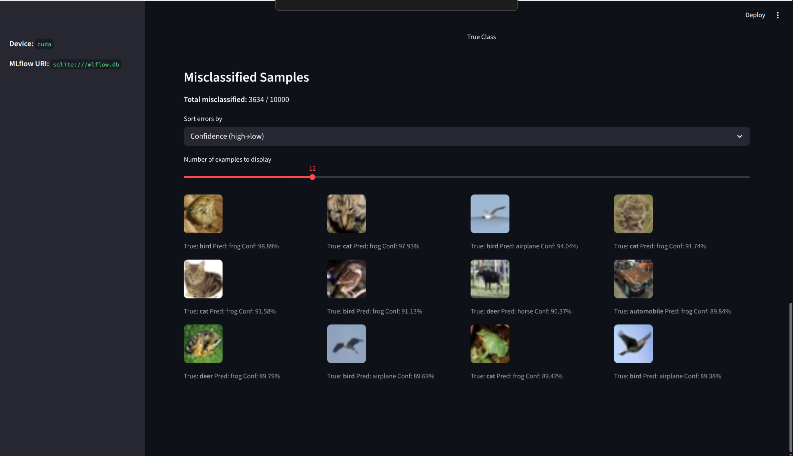
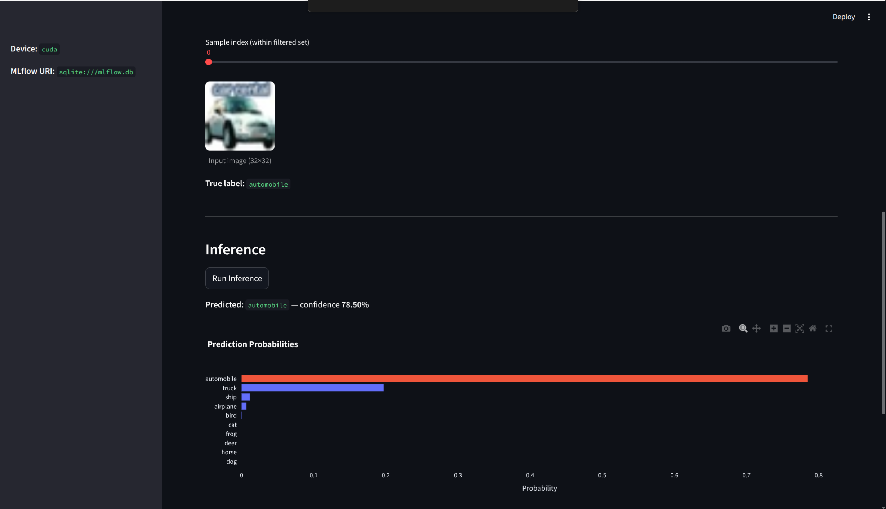
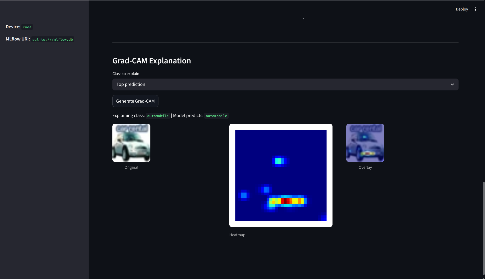

# Lab 06 Report: Interactive Dashboard for CIFAR-10 Model Analysis

## 1. Introduction

This lab builds an interactive analysis dashboard for the CIFAR-10 classification pipeline developed across Labs 01–05. The dashboard is implemented with Streamlit and integrates three analytical views: dataset exploration, error analysis against MLflow-tracked runs, and Grad-CAM explainability for individual predictions. The goal is to enable visual inspection of model behavior without writing ad hoc scripts for each analysis.

## 2. Architecture

The application is structured as a single Streamlit entry point (`app.py`) that delegates rendering to three UI modules, each backed by shared utility modules.

```
labs/lab06/
├── app.py                     # Streamlit entry point, caching, tab routing
├── configs/
│   └── config.yaml            # Paths, MLflow URI, inference settings
└── src/
    ├── data.py                # CIFAR-10 batch loading, CifarDataset, normalization
    ├── model.py               # CifarCNN definition
    ├── inference.py           # Batch inference and misclassified-sample extraction
    ├── gradcam.py             # GradCAM hook implementation, heatmap overlay
    ├── mlflow_utils.py        # MLflow experiment/run listing, artifact loading
    ├── viz.py                 # Plotly chart builders (distribution, confusion, bars)
    └── ui/
        ├── dataset_tab.py     # Dataset Exploration tab
        ├── error_tab.py       # Error Analysis tab
        └── explainability_tab.py  # Prediction & Explainability tab
```

`app.py` loads the YAML config at startup and uses `st.cache_data` for dataset loading and `st.cache_resource` for the MLflow client and loaded models to avoid recomputation on widget interaction. The three tabs are rendered independently, so interactions in one tab do not trigger rerenders of the others.

### Data pipeline

`data.py` loads raw CIFAR-10 pickle batches directly from the local `data/cifar-10-batches-py/` directory (no re-download). Images are denormalized back to HWC uint8 before display and kept as normalized CHW float tensors for model input. The normalization statistics match those used in Labs 03 and 04: mean `[0.4914, 0.4822, 0.4465]`, std `[0.2470, 0.2435, 0.2616]`.

### Model artifact loading

MLflow artifacts from Lab 04 are stored in a `model/` subdirectory of each run's artifact root (`model/best_model.pth`). `mlflow_utils.py` retrieves the artifact URI by listing the nested `model/` prefix before constructing a local file path for `torch.load`.

### Grad-CAM implementation

`GradCAM` in `gradcam.py` registers forward and backward hooks on `features[8]` (the second 64→128 Conv2d layer of CifarCNN). A forward pass with the target class triggers a backward pass; the gradient-weighted average of activation channels is ReLU'd and resized to 32×32 via bilinear interpolation. `overlay_heatmap` blends the colorized heatmap onto the original image at `alpha=0.5`.

## 3. Dataset Analysis

The Dataset Exploration tab gives an overview of split sizes, class counts, and a sample viewer with optional class filtering.



*Figure 1 — Dataset overview: split sizes and class distribution*

The training set contains 40,000 images across 10 classes; the validation set contains 10,000; the test set contains 10,000. The class distribution chart in Figure 1 shows that the training split is balanced at 4,000 images per class, which is consistent with the original CIFAR-10 construction and means no class weighting was needed during training (Lab 04).



*Figure 2 — Sample inspection: training set, frog class*



*Figure 3 — Sample inspection: validation set, deer class*

The sample viewer (Figures 2 and 3) allows browsing individual images by split, class, and index. This confirms that raw pixel variance is high within classes — different deer images vary substantially in pose, background, and scale — which explains the moderate per-class accuracies observed in the error analysis.

## 4. Error Analysis

The Error Analysis tab loads inference results for a selected MLflow run over the full validation set and presents a confusion matrix, per-class error bars, and a misclassified sample gallery.



*Figure 4 — Run selection and confusion matrix starting to load*



*Figure 5 — Confusion matrix for the best run (lr=0.0005, bs=128, accuracy=0.6366)*

The selected run (`lr_0.0005_bs_128`) matches the best run from Lab 04 (and Lab 05): learning rate 0.0005, batch size 128, achieving 63.66% accuracy on the validation set. The confusion matrix in Figure 5 shows the strongest diagonal entries for automobile and ship, while cat is the most confused class — frequently misclassified as dog and vice versa, which is expected given the visual similarity of domestic animal photos in CIFAR-10.



*Figure 6 — Per-class error counts and misclassified samples header*



*Figure 7 — Misclassified sample gallery (12 samples shown)*

Figure 6 shows that cat and bird have the highest error counts. Figure 7 displays individual misclassified samples with their true label, predicted label, and confidence score. A common failure mode visible in the gallery is low-contrast backgrounds causing the model to predict a contextually plausible but incorrect class (e.g., a bird over water predicted as ship).

## 5. Prediction and Explainability

The Prediction & Explainability tab runs inference on a single image selected from the validation set (or uploaded by the user) and displays the top-class probability bar chart and Grad-CAM visualization.



*Figure 8 — Prediction result: automobile class, 78.50% confidence*



*Figure 9 — Grad-CAM explanation: Original, Heatmap, Overlay*

Figure 8 shows the model predicting "automobile" with 78.5% confidence, which is correct. The Grad-CAM overlay in Figure 9 highlights the lower body of the vehicle — the bumper and wheel area — as the most discriminative region. This is consistent with what a model trained on 32×32 images would learn: at low resolution, the rectangular lower silhouette and front bumper are the most distinctive features separating automobiles from trucks and other vehicles.

The heatmap was generated from the last convolutional layer (`features[8]`), which captures high-level spatial features. Using an earlier layer would produce finer-grained but less semantically meaningful activations; the current choice balances locality and class specificity.

## 6. Running the Dashboard

```bash
cd /path/to/ml_engineering
streamlit run labs/lab06/app.py
```

The dashboard reads `labs/lab06/configs/config.yaml` for MLflow URI and data paths. MLflow runs from Lab 04 must be present under `./mlruns/` and the CIFAR-10 data under `./data/cifar-10-batches-py/`.

## 7. Reflection

### Benefits

- **Modular tab architecture**: Separating dataset, error, and explainability views into `src/ui/` modules keeps each tab independently maintainable and testable.
- **Caching integration**: `st.cache_data` for dataset loading and `st.cache_resource` for model and MLflow client eliminate recomputation on widget interaction without complicating the control flow.
- **MLflow reuse**: Connecting directly to the existing Lab 04 tracking database and artifact store required no data migration — the dashboard is a read-only consumer of prior experiment results.
- **Grad-CAM interpretability**: Hooking into `features[8]` (last conv layer) produces class-discriminative heatmaps that clearly highlight the model's spatial focus at inference time.

### Challenges

- **Artifact path discovery**: Lab 04 stored model weights under a `model/` subdirectory, not at the artifact root. A naive `list_artifacts()` call without a path prefix returns only top-level entries; the fix required explicitly listing the `model/` prefix to locate `.pth` files.
- **Streamlit rerun behavior**: Any widget state change triggers a full script rerun; without careful placement of cached loaders, heavy operations (inference over 10,000 images) would re-execute on every interaction.
- **Fixed hook target**: `GradCAM` is tied to `features[8]` by index, which couples the explainability module to the exact CifarCNN architecture. Any architectural change would require updating the hook target manually.

### Potential improvements

- Add a side-by-side Grad-CAM comparison view for the same image across two different MLflow runs to visualize how hyperparameter choices affect spatial attention.
- Display nearest training neighbors to a misclassified image using penultimate-layer embeddings and cosine similarity, to distinguish distribution-shift errors from inherent class ambiguity.
- Expose an upload widget in the Error Analysis tab to run inference on a user-supplied batch CSV instead of only the fixed validation set.
